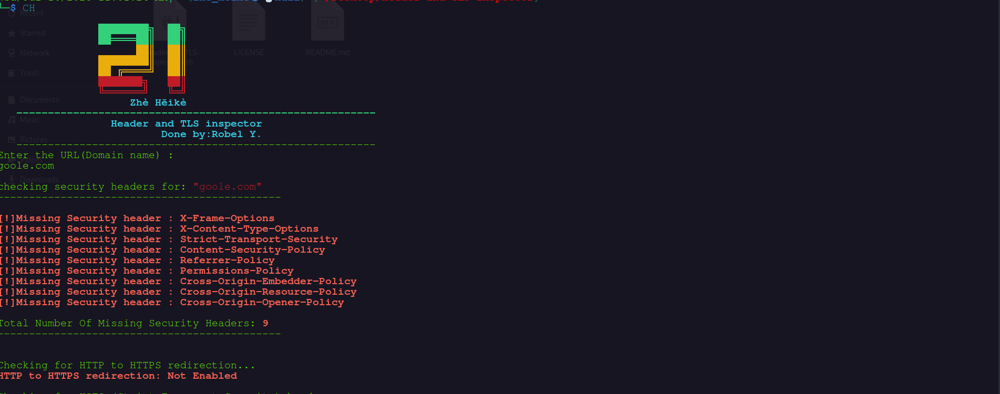
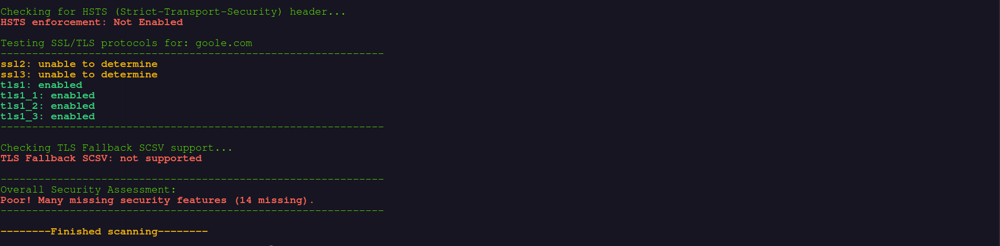

# 🔐 Zhè Hēikè - Header and TLS Inspector

A colorful and easy-to-use ZSH-based CLI tool to check:
- Missing security headers
- HTTP to HTTPS redirection
- HSTS enforcement
- TLS protocol support
- TLS Fallback SCSV

Created by **Robel Y.**

---

## 📸 Screenshot




---

## 🧰 Requirements
- `zsh`
- `curl`
- `openssl`
- Unix tools: `grep`, `sed`, `awk`

---

## 🚀 Usage
```bash
chmod +x checker.zsh
./checker.zsh
